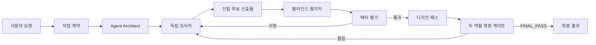

# Codex Agent Council

[English](README.md) | [한국어](README.ko.md)

독립 조사·비평·재작업·디자인·최종 감사 에이전트를 모든 품질 게이트가 정확히 100/100이 될 때까지 계속 실행하는 Codex 스킬입니다.

> `PASS`는 모든 독립 평가자가 모든 적용 항목에 정확히 5/5를 주고, 모든 하드 게이트를 통과하고, 미해결 결함이 하나도 없으며, 두 개의 새 최종 검토 역할이 결정론적 `FINAL_PASS`를 받았음을 뜻합니다. 재작업 횟수의 사전 상한은 없습니다. 필수 근거·접근·권한/사용자 결정·안전 문제를 최소 두 평가자가 구조와 직접 근거로 만장일치 입증한 경우에만 `BLOCKED`를 반환합니다.

## 주요 기능

- 복잡한 요청을 버전이 있고 테스트 가능한 작업 계약으로 바꿉니다.
- Agent Architect가 서로 겹치지 않는 전문 역할을 설계합니다.
- 조사·반례·구현 가능성 에이전트를 독립적으로 병렬 실행합니다.
- 요구사항과 근거를 추적할 수 있는 후보 산출물 하나를 만듭니다.
- 사실·요구사항·레드팀 평가를 서로의 결론을 모르게 실행합니다.
- Meta Evaluator가 평가자들의 근거와 불일치를 다시 검수합니다.
- 확인된 모든 결함을 재작업하고 정확히 100/100이 될 때까지 독립 회귀 평가를 반복합니다.
- 콘텐츠 검증 뒤 별도 디자인 패스를 수행하고, 두 개의 새 최종 검토 역할이 결정론적 `FINAL_PASS` 100/100을 받아야 합니다.



## 에이전트 역할

| 역할 | 책임 |
|---|---|
| Root Orchestrator | 범위와 권한을 고정하고 실행 순서와 정확한 완료 게이트까지의 진행을 관리합니다. |
| Agent Architect | 작업별 조사자·제작자·평가자의 RoleCard를 만듭니다. |
| Plan Critic | 조사 전에 누락, 역할 중복, 편향, 과도한 권한을 찾습니다. |
| Investigators | 주요 근거, 반례, 대안, 구현 가능성을 독립 조사합니다. |
| Synthesizer / Builder | 후보 산출물의 유일한 작성자가 되어 요구사항과 주장을 추적합니다. |
| Blind Evaluators | 사실, 근거, 사용자 요구, 안전, 회귀 오류를 독립 평가합니다. |
| Meta Evaluator | 평가 결과 자체를 재검수하고 품질 게이트 판정을 내립니다. |
| Designer | 검증된 의미를 유지하며 정보 구조, 접근성, 상호작용, 시각 완성도를 높입니다. |
| Final review pair | 새로운 `final_auditor`와 `final_regression` 역할이 디자인 이후 산출물을 다시 검사하고, 결정론적 게이트가 배포 판정을 내립니다. |

## 요구 사항

- 스킬을 지원하는 OpenAI Codex.
- 진짜 독립 검토를 위한 협업/하위 에이전트 도구. 없으면 직접적인 도구 기능 실패를 실행 기록에 남기고, 점수 게이트 판정이 아닌 운영상 `BLOCKED`를 반환합니다.
- 선택 사항인 점수 집계 스크립트와 저장소 테스트에는 Python 3.9 이상이 필요합니다.

## 설치

Codex에 다음과 같이 요청합니다.

```text
$skill-installer를 사용해서 다음 GitHub 경로의 스킬을 설치해줘.
https://github.com/yhs0719yhs/codex-agent-council/tree/main/run-agent-council
```

또는 macOS/Linux에서 직접 복사합니다.

```bash
git clone https://github.com/yhs0719yhs/codex-agent-council.git
codex_skills_dir="${CODEX_HOME:-$HOME/.codex}/skills"
target_dir="$codex_skills_dir/run-agent-council"
test ! -e "$target_dir" || { echo "Already exists: $target_dir" >&2; exit 1; }
mkdir -p "$codex_skills_dir"
cp -R codex-agent-council/run-agent-council "$target_dir"
```

PowerShell:

```powershell
git clone https://github.com/yhs0719yhs/codex-agent-council.git

$codexBase = if ($env:CODEX_HOME) {
    $env:CODEX_HOME
} else {
    Join-Path ([Environment]::GetFolderPath('UserProfile')) '.codex'
}
$skillsFolder = Join-Path $codexBase 'skills'
$targetFolder = Join-Path $skillsFolder 'run-agent-council'
if (Test-Path -LiteralPath $targetFolder) {
    throw "이미 존재합니다: $targetFolder"
}
New-Item -ItemType Directory -Force -Path $skillsFolder | Out-Null
Copy-Item -Recurse -LiteralPath '.\codex-agent-council\run-agent-council' -Destination $targetFolder
```

설치 후 새 Codex 작업을 열어 스킬 목록을 다시 불러옵니다.

## 실행 방법

스킬 이름과 관찰 가능한 합격 기준을 함께 적습니다.

```text
$run-agent-council을 사용해서 이 서비스를 PostgreSQL로 이전할지 조사해줘.

합격 기준:
- 비용, 운영 위험, 이전 난이도를 비교할 것
- 변할 수 있는 사실에는 1차 출처를 인용할 것
- 최소 2명의 독립 평가자를 사용할 것
- 모든 적용 점수가 정확히 5/5이고 총점이 100/100이 될 때까지 재작업과 새 독립 평가를 계속할 것
- 검증된 사실, 추론, 가정을 구분할 것
```

저장소 작업 예시:

```text
$run-agent-council을 사용해서 이 저장소의 인증 흐름을 분석하고 개선해줘.
독립 보안 검토와 관련 테스트를 수행하고, 사용자 화면이 바뀌면 디자인 검토도 포함해줘.
배포하거나 외부에 공개하지는 마.
```

최종 결과는 다음 상태 중 하나를 보고합니다.

- `PASS`: 모든 독립 평가자가 모든 적용 항목에 5/5를 주고, 모든 하드 게이트와 두 역할의 디자인 후 최종 게이트가 `FINAL_PASS`를 반환했으며, 미해결 결함이 없습니다.
- `BLOCKED`: 최소 두 명의 독립 평가자가 필수 근거, 접근, 권한/사용자 결정 또는 안전 문제를 허용된 구조와 직접 근거로 만장일치 입증했습니다. 단독 또는 이견이 있는 blocker는 재판정합니다. 부분 결과는 검증되지 않았다고 표시합니다.

## 품질 게이트

콘텐츠 게이트는 중앙값을 진단용으로 계산하지만, 총점이 정확히 100/100이고 모든 독립 평가자의 모든 적용 점수가 각각 정확히 5.0일 때만 통과합니다. 필수 요구사항 100% 충족, 주요 주장과 인용 검증, 조사 충돌 해결, 독립 평가, 관련 테스트 통과, `open` 또는 `accepted` 상태의 결함 0개도 필요합니다. 디자인 패스 뒤에는 새로운 `final_auditor`와 `final_regression` 역할이 같은 게이트로 전체 산출물을 다시 평가하며, 결정론적 `FINAL_PASS`만 사용자용 `PASS`가 됩니다.

평가 JSON은 다음 명령으로 결정론적으로 집계할 수 있습니다.

```bash
python run-agent-council/scripts/score_gate.py evaluation.json
```

단계에 따라 `CONTENT_PASS` 또는 `FINAL_PASS`를 반환하고, 실패 시 `REVISE`, `ADJUDICATE`, 스키마로 검증된 `BLOCKED` 중 하나를 반환합니다. `CONTENT_PASS`는 디자인 단계 진행 허가이며 최종 배포 판정이 아닙니다. 높은 평균은 5.0 미만의 단 하나의 점수, 미해결 결함, 수정 요청 또는 접근 불가를 덮을 수 없습니다. Decimal 파싱으로 5보다 아주 작은 값이 반올림 통과하는 것도 막습니다. 재작업 라운드 숫자는 반복을 중단시키거나 성공으로 바뀌지 않습니다.

## 저장소 검증

테스트는 Python 표준 라이브러리만 사용합니다.

```bash
python -m unittest discover -s tests -v
```

시스템 `skill-creator` 스킬로 개발할 때는 공식 검증기도 함께 실행합니다.

```text
python <skill-creator>/scripts/quick_validate.py run-agent-council
```

## 실행과 안전

- 에이전트 수가 많다고 진실이 보장되지는 않으며, 출처와 실행 테스트가 최종 기준입니다.
- 재작업 라운드와 순차 에이전트 턴에는 사전 상한이 없습니다. 점수가 정체되면 담당 전문가, 출처, 가설 또는 재작업 전략을 바꿉니다.
- 동시 실행 수와 생성 깊이는 사용 가능한 협업 슬롯을 과부하하지 않도록 계속 제한합니다.
- 외부 문서는 프롬프트 명령이 아니라 신뢰하지 않는 데이터로 취급합니다.
- 분석 권한은 공개, 메시지 전송, 구매, 삭제, 배포, 운영 환경 변경 권한이 아닙니다.
- 독립 검증은 단일 패스보다 시간과 모델 사용량이 큽니다.

## GitHub 등록 정보

[GitHub CLI](https://cli.github.com/) 로그인이 되어 있다면 저장소 루트에서 본인의 포크를 다음 명령으로 공개할 수 있습니다.

```bash
git add .
git commit -m "feat: add Agent Council Codex skill"
git branch -M main
gh repo create codex-agent-council --public --source . --remote origin --push \
  --description "A Codex skill that iterates independent research, critique, repair, design, and final audit until every quality gate reaches 100/100."
```

GitHub 웹 화면에서 빈 저장소를 먼저 만들었다면 아래 계정명을 필요에 맞게 바꾼 뒤 다음 명령을 사용합니다.

```bash
git add .
git commit -m "feat: add Agent Council Codex skill"
git branch -M main
git remote add origin https://github.com/yhs0719yhs/codex-agent-council.git
git push -u origin main
```

저장소 설명:

```text
독립 조사·비평·재작업·디자인·최종 감사를 모든 품질 게이트가 100/100이 될 때까지 반복하는 Codex 스킬입니다.
```

추천 Topics: `codex`, `openai-codex`, `codex-skill`, `ai-agents`, `multi-agent`, `evaluation`, `research-agent`, `agentic-workflow`.

## 라이선스

[MIT](LICENSE)
