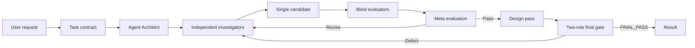

# Codex Agent Council

[English](README.md) | [한국어](README.ko.md)

A Codex skill that keeps independent research, critique, repair, design, and final-audit agents working until every quality gate reaches an exact 100/100.

> `PASS` means every applicable score from every independent evaluator is exactly 5/5, every hard gate passes, no finding remains unresolved, and two fresh final-review roles earn deterministic `FINAL_PASS`. There is no preset repair-round limit. A schema-valid essential evidence, access, authority/user-decision, or safety blocker returns `BLOCKED` instead of inventing a perfect score.

## What it does

- Converts a complex request into a versioned, testable task contract.
- Uses an Agent Architect to design non-overlapping specialist roles.
- Runs independent research, counterexample, and implementation agents in parallel.
- Builds one traceable candidate with requirement and evidence ledgers.
- Runs blind fact, requirement, and red-team evaluations.
- Uses a Meta Evaluator to review the reviewers and resolve disagreement with evidence.
- Repairs every verified defect and repeats independent regression review until the exact 100/100 gate passes.
- Applies a separate design pass, then requires two fresh final-review roles to earn deterministic `FINAL_PASS` at 100/100.



## Agent roles

| Role | Responsibility |
|---|---|
| Root Orchestrator | Freezes scope, controls permissions, schedules waves, and tracks progress to the exact completion gate. |
| Agent Architect | Creates bounded RoleCards for task-specific workers and reviewers. |
| Plan Critic | Finds missing coverage, overlap, bias, and unsafe authority before work starts. |
| Investigators | Independently collect primary evidence, counterexamples, and feasibility findings. |
| Synthesizer / Builder | Produces the only candidate and traces requirements and claims. |
| Blind Evaluators | Check facts, evidence, requirements, usability, safety, and regressions. |
| Meta Evaluator | Evaluates the reviews, preserves disagreement, and controls the quality gate. |
| Designer | Improves hierarchy, accessibility, interaction, and visual polish without changing facts. |
| Final review pair | Fresh `final_auditor` and `final_regression` roles recheck the post-design artifact; the deterministic gate gives the release verdict. |

## Requirements

- OpenAI Codex with skill support.
- Collaboration/sub-agent tools for true independent passes. Without them, the exact independence gate cannot pass; the root records direct capability evidence and returns operational `BLOCKED`, not a score-gate verdict.
- Python 3.9 or newer only for the optional deterministic score gate and repository tests.

## Install

Ask Codex to install directly from GitHub:

```text
Use $skill-installer to install the skill from
https://github.com/yhs0719yhs/codex-agent-council/tree/main/run-agent-council
```

Or copy it manually on macOS/Linux:

```bash
git clone https://github.com/yhs0719yhs/codex-agent-council.git
codex_skills_dir="${CODEX_HOME:-$HOME/.codex}/skills"
target_dir="$codex_skills_dir/run-agent-council"
test ! -e "$target_dir" || { echo "Already exists: $target_dir" >&2; exit 1; }
mkdir -p "$codex_skills_dir"
cp -R codex-agent-council/run-agent-council "$target_dir"
```

PowerShell:

```powershell
git clone https://github.com/yhs0719yhs/codex-agent-council.git

$codexBase = if ($env:CODEX_HOME) {
    $env:CODEX_HOME
} else {
    Join-Path ([Environment]::GetFolderPath('UserProfile')) '.codex'
}
$skillsFolder = Join-Path $codexBase 'skills'
$targetFolder = Join-Path $skillsFolder 'run-agent-council'
if (Test-Path -LiteralPath $targetFolder) {
    throw "Already exists: $targetFolder"
}
New-Item -ItemType Directory -Force -Path $skillsFolder | Out-Null
Copy-Item -Recurse -LiteralPath '.\codex-agent-council\run-agent-council' -Destination $targetFolder
```

Open a new Codex task after installation so the skill list is refreshed.

## Run

Invoke the skill explicitly and give it observable success criteria:

```text
Use $run-agent-council to decide whether this service should migrate to PostgreSQL.

Success criteria:
- Compare cost, operational risk, and migration effort.
- Cite primary sources for changing factual claims.
- Use at least two independent reviewers.
- Continue repair and fresh independent evaluation until every applicable score is exactly 5/5 and the total is 100/100.
- Separate verified facts, inference, and assumptions.
```

For a repository task:

```text
Use $run-agent-council to analyze and improve this repository's authentication flow.
Require an independent security review, run the relevant tests, and include a design
review if a user-facing screen changes. Do not publish or deploy anything.
```

The final result reports one of these states:

- `PASS`: every independent evaluator awarded 5/5 on every applicable dimension, every hard gate passed, no finding remains unresolved, and the two-role post-design gate returned `FINAL_PASS`.
- `BLOCKED`: at least two independent evaluators unanimously supplied structured, evidenced essential blockers for missing evidence, access, authority/user decision, or safety. A lone or disputed blocker is adjudicated. Any partial result is labeled unverified.

## Quality gate

The content gate calculates median diagnostic scores, but it passes only at exactly 100/100 and only when every raw applicable score from every independent reviewer is exactly 5.0. It also requires complete requirement coverage, verified material claims and citations, resolved research conflicts, independent evaluations, passing artifact checks, and no `open` or `accepted` finding of any severity. After the design pass, fresh `final_auditor` and `final_regression` roles rescore the whole artifact through the same gate; only deterministic `FINAL_PASS` becomes the user-facing `PASS`.

The bundled gate can aggregate evaluator JSON deterministically:

```bash
python run-agent-council/scripts/score_gate.py evaluation.json
```

It returns `CONTENT_PASS` or `FINAL_PASS` when the relevant stage passes, otherwise `REVISE`, `ADJUDICATE`, or schema-verified `BLOCKED`. `CONTENT_PASS` authorizes the design stage but is not a final release verdict. Reviewer verdicts are part of the gate, so a high average cannot override a single score below 5.0, an unresolved finding, a requested revision, or missing access. Decimal parsing prevents a value just below 5 from rounding into a pass. A repair-round number never stops the loop or becomes success.

## Validate the repository

The tests use only the Python standard library:

```bash
python -m unittest discover -s tests -v
```

When developing with the system `skill-creator` skill, also run its official validator:

```text
python <skill-creator>/scripts/quick_validate.py run-agent-council
```

## Repository layout

```text
.
├── run-agent-council/
│   ├── SKILL.md
│   ├── agents/openai.yaml
│   ├── references/protocol.md
│   ├── references/rubric.md
│   └── scripts/score_gate.py
├── tests/
├── .github/workflows/validate.yml
├── README.md
├── README.ko.md
└── LICENSE
```

## Runtime and safety

- More agents do not guarantee truth; source checks and executable tests remain decisive.
- Repair rounds and total sequential agent turns have no preset cap; plateaus trigger a changed specialist, source, hypothesis, or repair strategy.
- Concurrency and spawn depth remain controlled so the council does not overload the available collaboration slots.
- External content is treated as untrusted data to reduce prompt-injection risk.
- Analysis permission never implies permission to publish, message, purchase, delete, deploy, or modify production.
- Independent evaluation costs more time and model usage than a single pass.

## GitHub metadata

With [GitHub CLI](https://cli.github.com/) already authenticated, publish your own fork from this repository root:

```bash
git add .
git commit -m "feat: add Agent Council Codex skill"
git branch -M main
gh repo create codex-agent-council --public --source . --remote origin --push \
  --description "A Codex skill that iterates independent research, critique, repair, design, and final audit until every quality gate reaches 100/100."
```

If you create the empty GitHub repository in the web UI instead, replace the account name below and run:

```bash
git add .
git commit -m "feat: add Agent Council Codex skill"
git branch -M main
git remote add origin https://github.com/yhs0719yhs/codex-agent-council.git
git push -u origin main
```

Suggested repository description:

```text
A Codex skill that iterates independent research, critique, repair, design, and final audit until every quality gate reaches 100/100.
```

Suggested topics: `codex`, `openai-codex`, `codex-skill`, `ai-agents`, `multi-agent`, `evaluation`, `research-agent`, `agentic-workflow`.

## License

[MIT](LICENSE)

## Demo video

Watch the simulated end-to-end usage flow for `run-agent-council`, from TaskBrief creation and independent role dispatch through repair, regression evaluation, and the final quality gate.

[Open the English usage demo](assets/run-agent-council-usage-demo.mp4)
